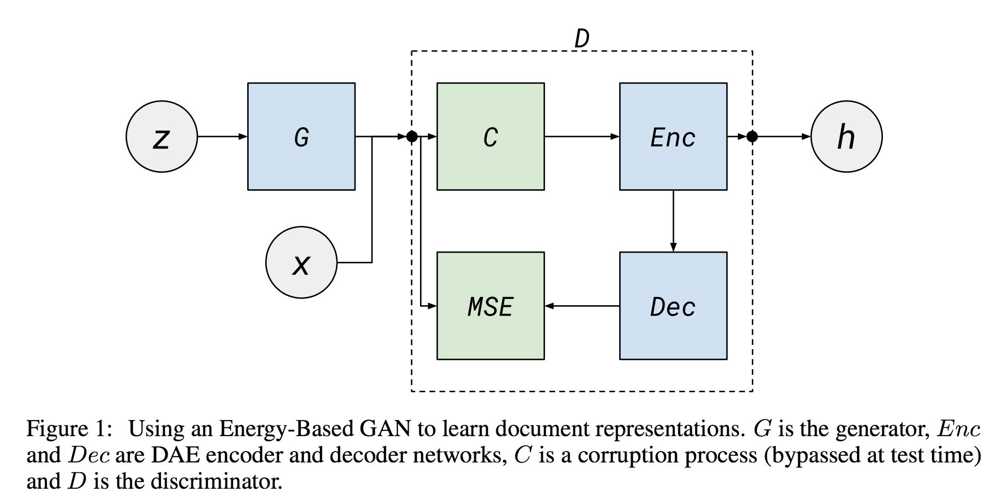
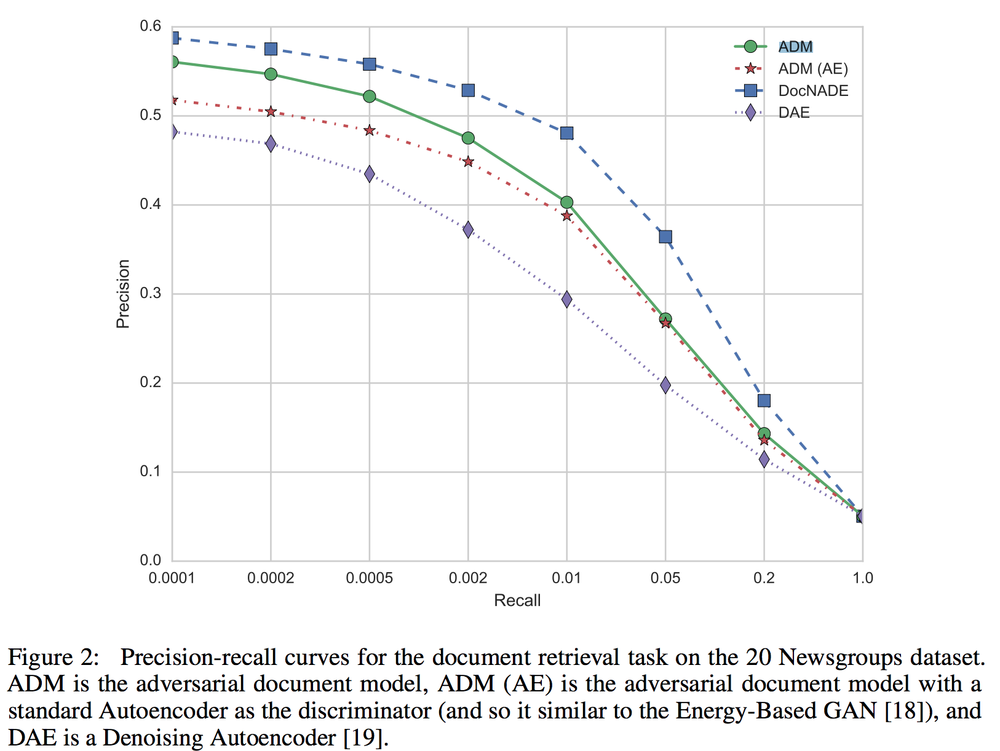
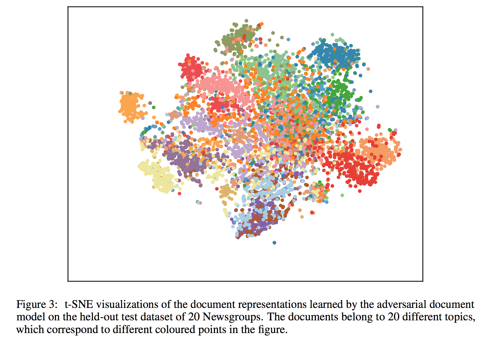

[Modeling documents with Generative Adversarial
Networks](https://c4209155-a-62cb3a1a-s-sites.googlegroups.com/site/nips2016adversarial/WAT16_paper_19.pdf?attachauth=ANoY7cpcPs0IYgKKWHxlLIyz94Do8vTCgK7J_sk7JjlboTNEGjqt5jzwxV9cmGO8xXu2NQWlzSK95wDz6ijYBgZO-Renz6lq4XpdDIClMoluqgxQw5qXgCQ-f-wqFuYfPJFQuWRVdUNW0USiDGoI623a6QXX7B5xrAosWDc7sDltT6le1cdXJmweP2v7-z6Gt_ygW9YCfMhzmrMXYUjhHIkoghp9YGQp0FpEi2IMHKwg6appa4YLdos%3D&attredirects=0)

## Goal
GAN performence with nlp tasks, especially
discovering methods for distributed representation documents using GAN.

## Model
facts: 
1. Energy based model perform better than probabilstic model
2. Denoising AutoEncoder within the discriminator to learn the document representation 

## Experiments
1. comparision against DocNade

2. t-sne doc representation 

