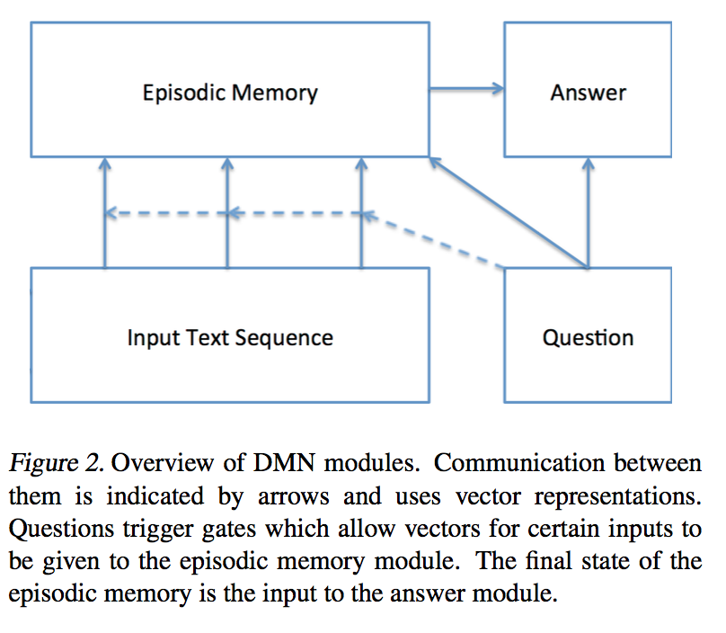
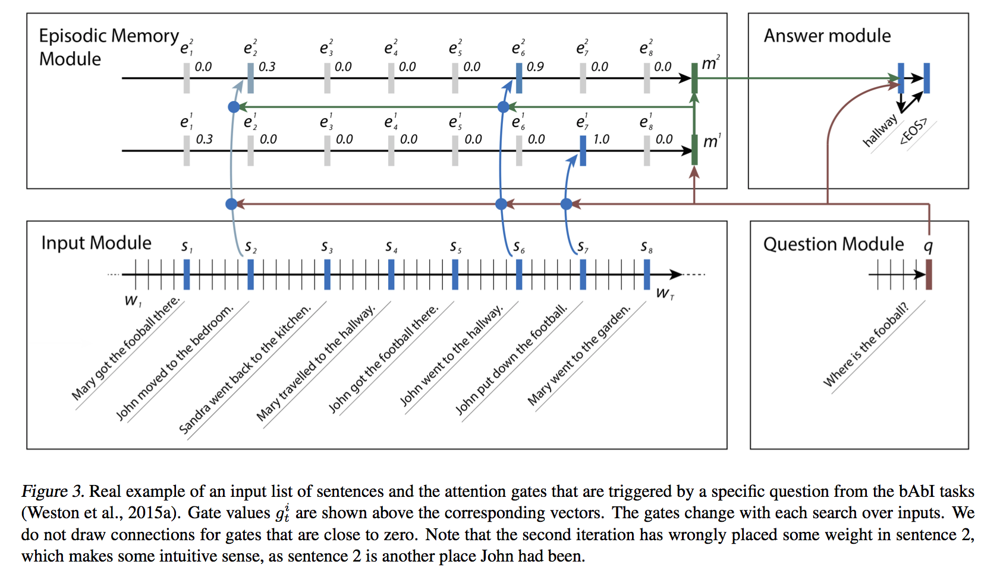
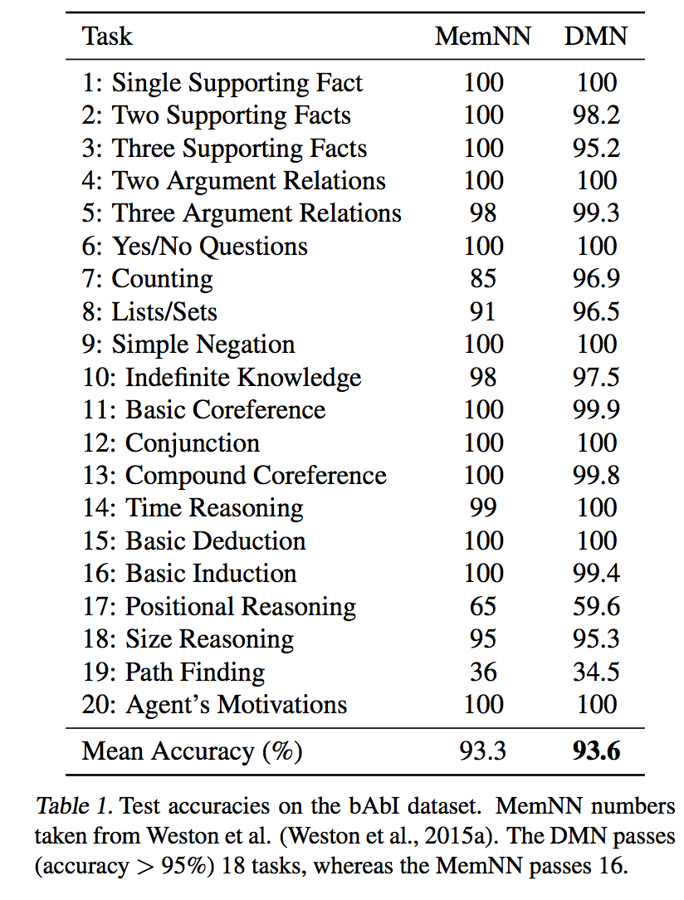

[Ask Me Anything: Dynamic Memory Networks for Natural Language Processing](https://pdfs.semanticscholar.org/70b2/1f7c1670b89e48cabc00fd2e386da558bfa3.pdf?_ga=1.34565089.1904056589.1479429331)

## Goal
a framework for general question answering tasks trained using (input, question, answer). 

## Tasks
sequence tagging, classification, sequence-to-sequence(seq2seq), question answering(QA) that requires transiitve reasoning.

## Model

### Input Module
encode raw inputs(images, texts(sentences, story, tweets...etc) ) to distibuted vector representation. 

GRU is used instead of LSTM for computation efficiency with similar performence. 

### Question Module
encode raw question of tasks. Then fed into espsodic memory module(EMM) as initial state/basis for it(EMM) to iterates.

Share word embedding matrix accross Input module and Question Module.

### Episodic Memory Module
Iteratively **attend different part of the input** given the current state. 

(share some similarity to hops between controller module and memory module from [End-To-End Memory Networks(MemN2N)](http://arxiv.org/abs/1503.08895)) 

Compromised of an attention mechanism within a recurrent network.

Score function G of the answer is an 2-layer feed forward Neural Network as well.

Criteria for stopping includes a end-of-passes representation for the GRU to choose as well as a maximum number of iteration just in case. 
### Answer Module
Generate answer from final memory vector from EMM.

## Training

## Experiments

###QA

TODO: Experiments is not complete

