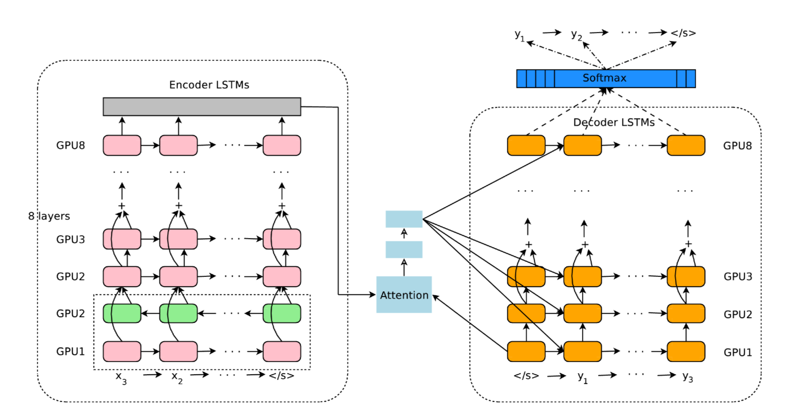
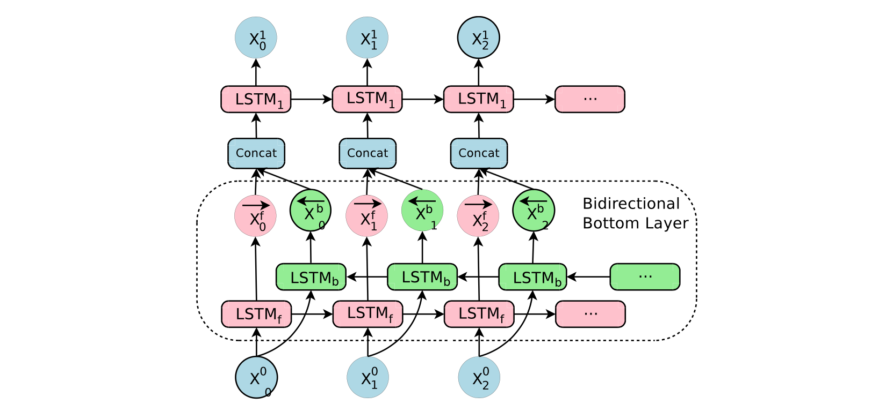
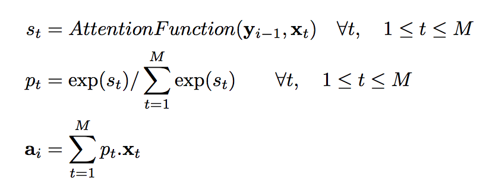
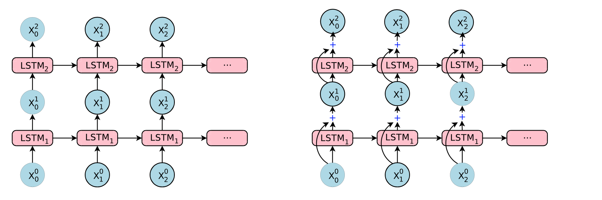
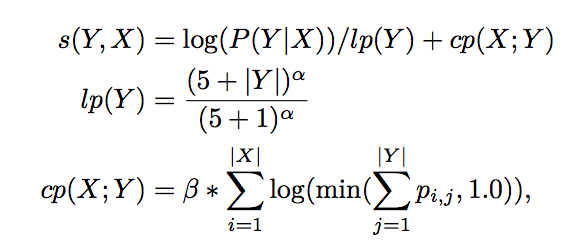
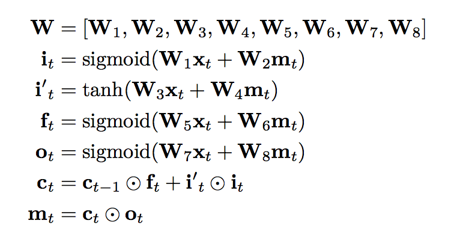
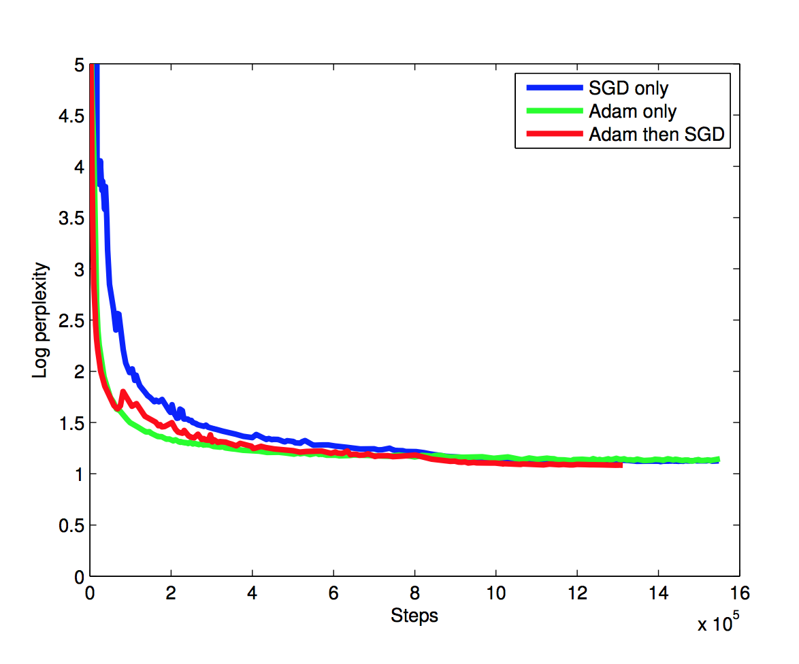

Google’s Neural Machine Translation System: Bridging the Gap between Human and Machine Translation

This is google's newest machine translation system based on deep learining(NMT) disclosure in detail. It's a weights more on the techniques/tricks used to build the **production enviroment system**.

Three inherent weaknesses of Neural Machine Translation GNMT tends to solve:
1. its slower training and inference speed
2. ineffectiveness in dealing with rare words
3. sometimes failure to translate all words in the source sentence

## Model

1. 8 hidden layer LSTM RNNs (in encoder network and decoder network)
2. residual connections
3. attention (attention network)

### deep stacked LSTM
Since each additional layer reduced [perplexity](https://en.wikipedia.org/wiki/Perplexity) by nearly 10% showed by paper[1], this model stacked 8 layers to encoder and decoder, 

with first encoder layer a bidirectional layer to have the best possible context at each point in the encoder network,which is also used in [2]. **To allow for maximum possible parallelization** during computation, bi-directional connections are only used for the bottom encoder layer – all other encoder layers are uni-directional.

### attenion network
Attention function is learned through a 1 hidden layer neural network. 

### residual connections
Simple stacked LSTM layers work well up to 4 layers, barely with 6 layers, and very poorly beyond 8 layers. Thanks to [3], deeper stack lstm is working. 

## Other techniques

1. sub-word units(wordpieces)
2. beam search

### wordpieces
This technique is introduced when developed to solve a Japanese/Korean segmentation problem for the Google speech recognition system in [4]. Wordpieces model is a data-driven model and guaranteed to generate a deterministic segmentation for any possible sequence of characters. It is similar to the method used in [5] to deal with rare words in Neural Machine Translation.

an example of wordpiece:
• Word: Jet makers feud over seat width with big orders at stake
• wordpieces: _J et _makers _fe ud _over _seat _width _with _big _orders _at _stake

This is just introduce higher dimension to learn the subtlety of morphology.

### decoder beam search
Typically keep 8-12 hypotheses but we find that using fewer (4 or 2) has only slight negative effects on BLEU scores.

Refinements to the pure max-probability based beam search algorithm:  
1. a coverage penalty [6]
2. length normalization

Without some form of length-normalization regular beam search will favor shorter results over longer ones on average since a negative log-probability is added at each step, yielding lower (more negative) scores for longer sentences.

## tricks

1. low precision at inference
 constrains during training:
 

2. train first with adam then standard sgd

 

## Reference
[1]Sutskever, I., Vinyals, O., and Le, Q. V. Sequence to sequence learning with neural networks. In Advances in Neural Information Processing Systems (2014), pp. 3104–3112.

[2]Bahdanau, D., Cho, K., and Bengio, Y. Neural machine translation by jointly learning to align and translate. In International Conference on Learning Representations (2015).

[3]Ren, Shaoqing, et al. "Faster R-CNN: Towards real-time object detection with region proposal networks." Advances in neural information processing systems. 2015.

[4]Schuster, M., and Nakajima, K. Japanese and Korean voice search. 2012 IEEE International Conference on Acoustics, Speech and Signal Processing (2012).

[5]Sennrich, R., Haddow, B., and Birch, A. Neural machine translation of rare words with subword units. In Proceedings of the 54th Annual Meeting of the Association for Computational Linguistics (2016).

[6]Tu, Z., Lu, Z., Liu, Y., Liu, X., and Li, H. Coverage-based neural machine translation. In Proceedings of the 54th Annual Meeting of the Association for Computational Linguistics (2016).
