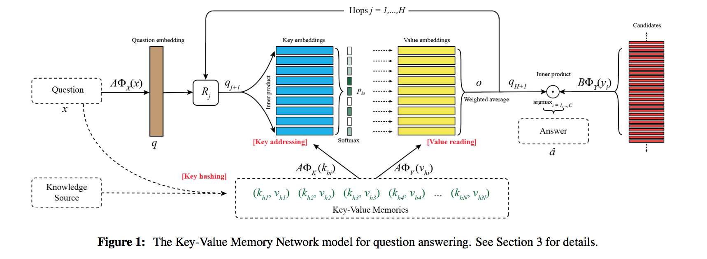

[Key-Value Memory Networks for Directly Reading Documents](https://pdfs.semanticscholar.org/1b29/786b7e43dda1a4d6ee93f520a2960b1e3126.pdf?_ga=1.3491568.1904056589.1479429331)

## Goal
Model goal:
towards working on knowledge source from either unstructured documents or structured knowledge base such as FreeBase.

Structure goal:
Storing key-value structured memory before reasoning, keys to address relevant memories to the question, value as facts supporting reasoning. In other words, key feature vectors should be design to match the question and value feature vectors should be design to match (partial) answers. 

## Model

### Memory
#### key
**key hashing** is used to pre-select a subset of questions sharing same words excluding stop words. **key addressing** is used to assign probabilites to each element(key) in the set of the key hashing results.

#### value
**value reading** is then the weighted sum of the addressing probabilities on values features.

### controller 
as the query for each hops, query is updated for each hops back from memory network. key hashing is not performed during those hops. 

Like previous MemNN and MemN2N, controller computed a final prediction. 

query, anser,keys and values are free to define to suit the best performence of the dataset/task.

## Train
**key-value transforms** while using standard backpropagation via SGD.
key-value transforms is
## Experiments
dataset: WIKIMOVIES, WIKIQA

WIKIQA:

##My questions
1.  why number of hops can not be learned by a network? 
