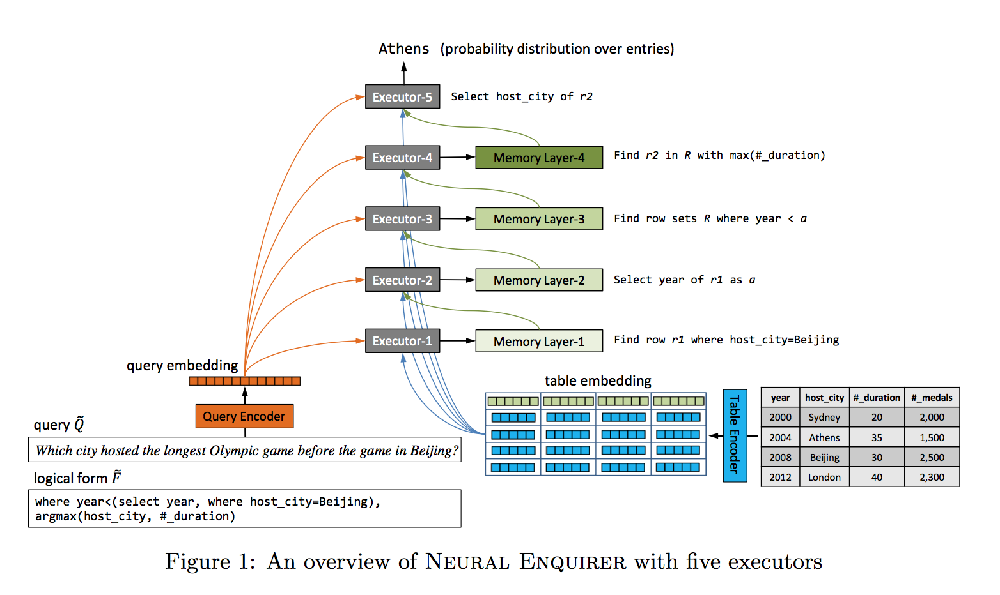
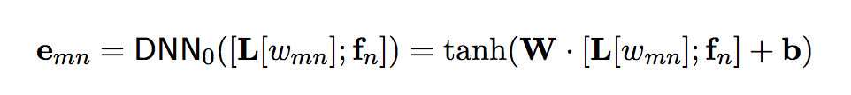
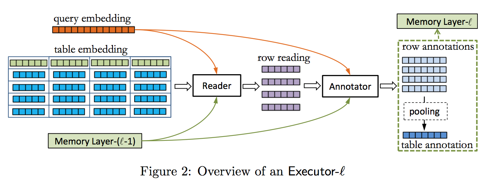
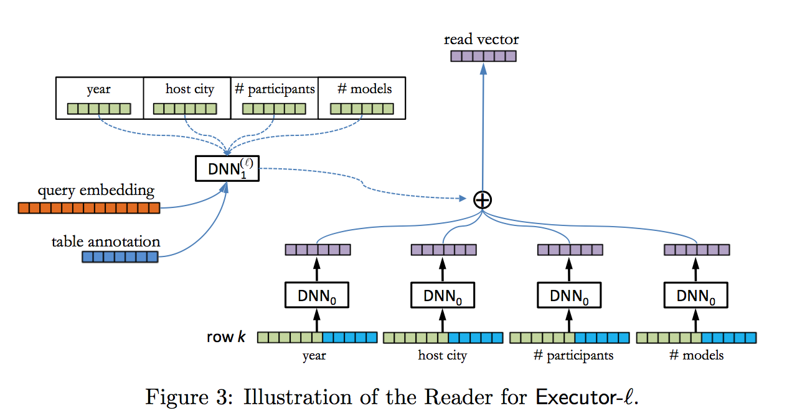
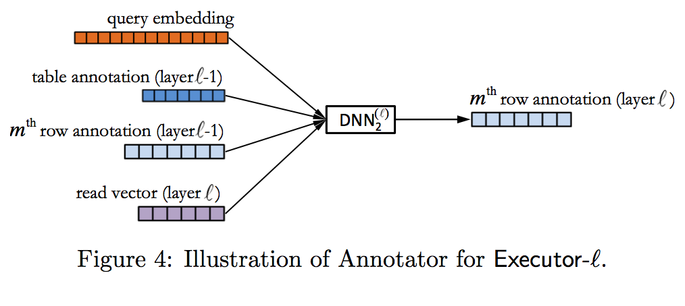
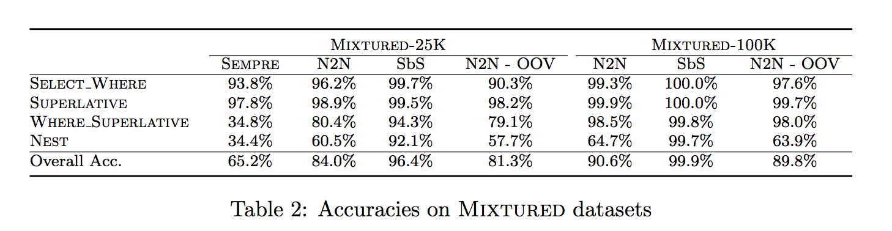

[Neural Enquirer: Learning to Query Tables with Natural Language](https://arxiv.org/pdf/1512.00965v2.pdf)

## Goal
A neural network aka Neural Enquirer(NE) to execute a natural language query on knowledge-base for answer.

## Model
vs End-to-End semantic parser
NE is fully differentiable. 

### Query Encoder
bi-direction RNN

### Table Encoder

embedding of element at m,n of the table is a one layer non-linearity for a matrix transformation given the contatination of the embedding element at corresponding index with the corresponding column field name embedding.

### Executor

each executor is responsible for one type of operation(select, where, max etc.) 

Query is executed as a cascade process of the executers.

####Memory 
Memory layer is used to store the intermediate result of the executers with each annotator has access to previous temporal-level memory.

#### Reader
attention agnostic to each value in the row 

#### Annotator

## Train
N2N

### train semantic parsing component
this paper is more like working towards using the table structure(compositional structure) through a N2N training to minimized the draw back in semantic representation of the query sentence embedding.

## Experiments
Dataset: huawei's own synthetic dataset.(not yet public available)
comparision against SEMPRE:

##My questions
how to optimize the speed if each query need to search the whole table with distributed representation?(aka scalability)
