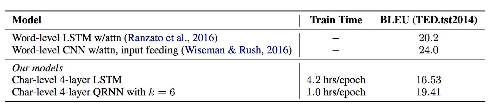

#QUASI-RECURRENT NEURAL NETWORKS

This paper proposed QRNN mainly to address the expensive computation for deep stacked LSTM. There are some interesting results on decent improvement of char level MT, small drawback on language modeling but all in 10x faster compared to deep stacked variant of LSTM.

features:
1. stacked QRNNs have better predictive accuracy than stacked LSTMs of the same hidden size
2. neural sequence modeling that alternates convolutional layers, which apply in parallel across timesteps, and a minimalist recurrent pooling function that applies in parallel across channels. **16 times faster** at train and test time.

experiments on QRNN:
1. language modeling

2. sentiment classification
3. character-level neural machine translation



## Model


**Stacked LSTM requires expensive computation, but is it neccessary that we have to stack same architechure of LSTM for RNN to work?
This model tries to seperate the LSTM by when we can process signal in full paralism and when we need to have this markov propety.**

In a gist of the core contribution of this paper, if ⊙ denotes elementwise multiplication.
### f-pool:
The simplest option, which Balduzzi & Ghifary (2016) term “dynamic average pooling”, uses only a forget gate:
	`ht =ft ⊙ht−1 +(1−ft)⊙zt`
	
### fo-pool:
The function may also include an output gate: 
```ct =ft ⊙ct−1 +(1−ft)⊙zt, 
	ht = ot ⊙ ct
```

### ifo-pool:
recurrence relation may include an independent input and forget gate:
```ct =ft ⊙ct−1 +it ⊙zt,
ht = ot ⊙ ct.
```

