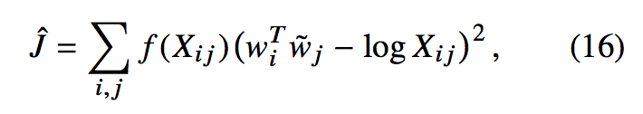
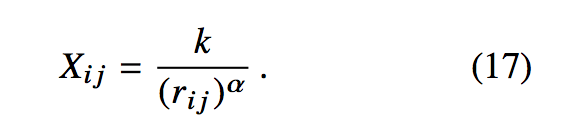
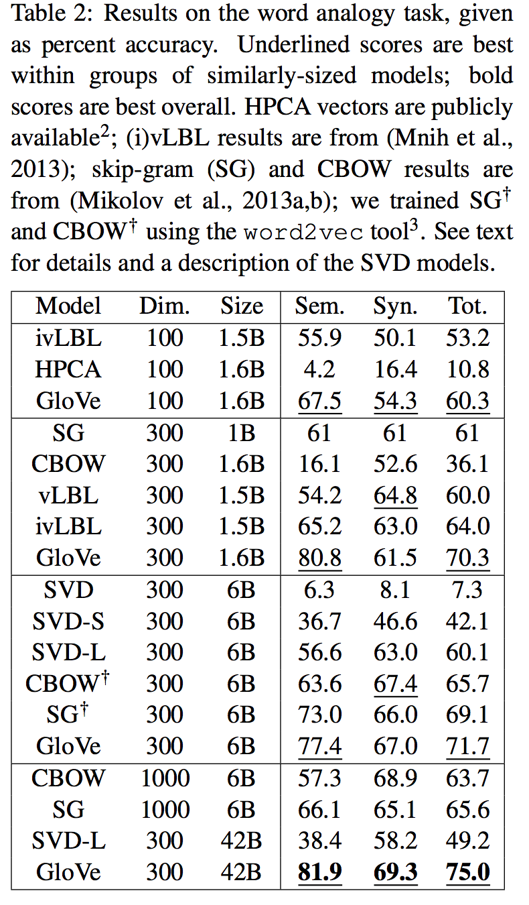
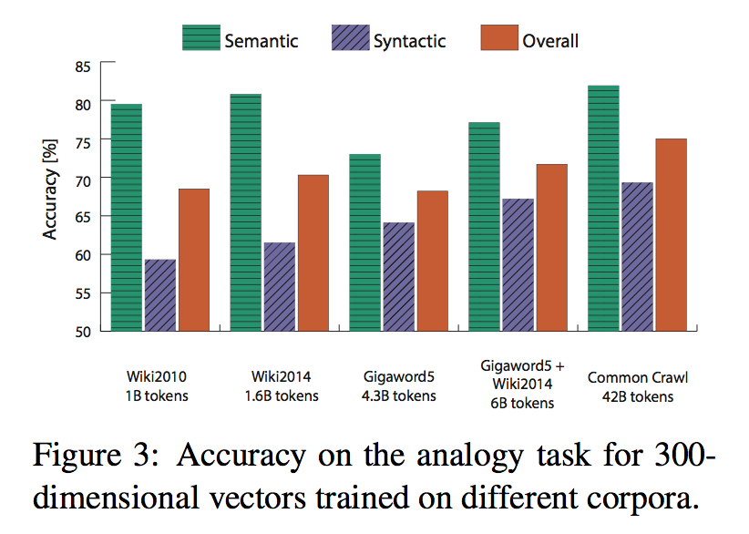
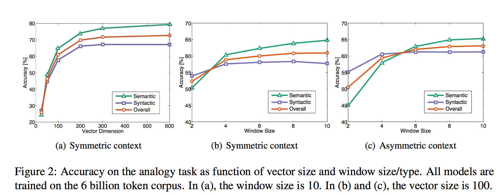
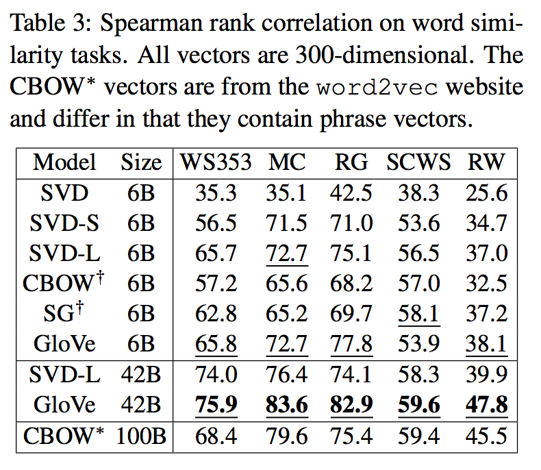
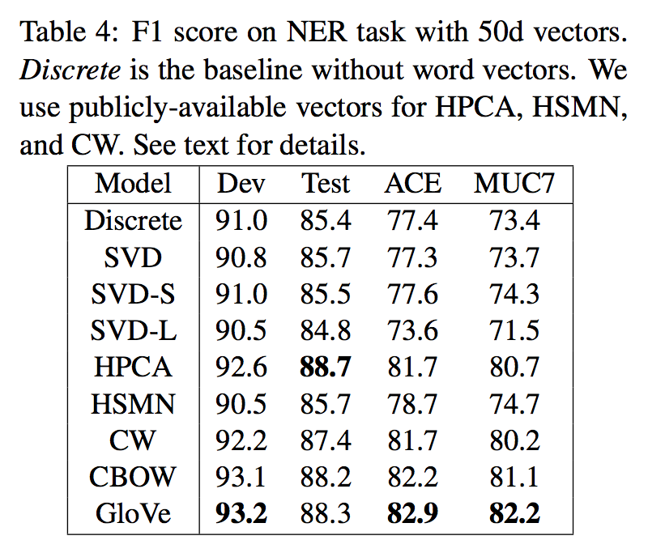
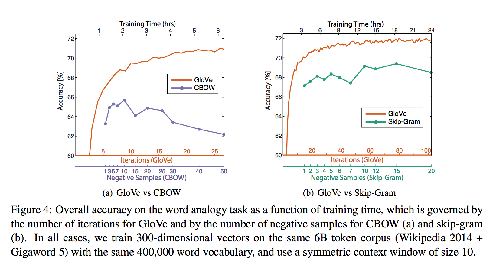

[Glove](http://www-nlp.stanford.edu/pubs/glove.pdf)

## Goal
Improve word representation  by a global logbilinear regression model that combining combining advantages of global matrix factorization(global context of word co-occurence) methods and local context window methods.

## Model

where Xij is the co-occurence matrix with i index for one word, and j index for another word.

f is a weighted function help address co-occurences equally problem. 


1. f (0) = 0. If f is viewed as a continuous function, it should vanish as x → 0 fast enough that the limx→0 f (x) log2 x is finite.
2. f (x) should be non-decreasing so that rare co-occurrences are not overweighted.
3. f ( x ) should be relatively small for large values of x, so that frequent co-occurrences are not overweighted.

see more detail evolution of the cost function derivation from section 3.

### Model complexity

For the corpa studied within the paper, author give α=1.25. Therefore the model complexity is |X| = O(|C|0.8) compared to online window based methods which scale like O(|C|).

## Training
five corpora of varying sizes: a 2010 Wikipedia dump with 1 billion to- kens; a 2014 Wikipedia dump with 1.6 billion to- kens; Gigaword 5 which has 4.3 billion tokens; the combination Gigaword5 + Wikipedia2014, which has 6 billion tokens; and on 42 billion tokens of web data, from Common Crawl5. We tokenize and lowercase each corpus with the Stanford to- kenizer, build a vocabulary of the 400,000 most frequent words6, and then construct a matrix of co- occurrence counts X.

For all our experiments, we set xmax = 100, α = 3/4, and train the model using AdaGrad (Duchi et al., 2011), stochastically sampling non- zero elements from X, with initial learning rate of 0.05. We run 50 iterations for vectors smaller than 300 dimensions, and 100 iterations otherwise (see Section 4.6 for more details about the convergence rate). Unless otherwise noted, we use a context of ten words to the left and ten words to the right.

The model generates two sets of word vectors, W and W ̃. When X is symmetric,W and W ̃are equivalent and differ only as a result of their ran- dom initializations; the two sets of vectors should perform equivalently. On the other hand, there is evidence that for certain types of neural networks, training multiple instances of the network and then combining the results can help reduce overfitting and noise and generally improve results (Ciresan et al., 2012). With this in mind, we choose to use the sum W + W ̃ as our word vectors. Doing so typ- ically gives a small boost in performance, with the biggest increase in the semantic analogy task.

## Experiments
### Word analogy
semantic questions [Athens is to Greece as Berlin is to___]
and syntactic questions[dance is to dancing as fly is to __]
we can see a huge **advantages of GloVe on semantic captures.**

### Word similarity

### NER

### Comparison with word2vec

## Result

## questions
1. Fisher vectors thoughts applied to word vector for better accuracy/seperation?
